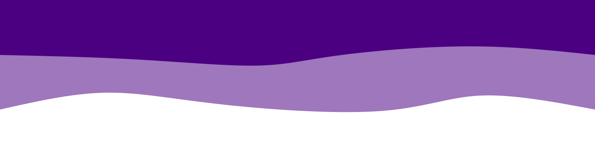
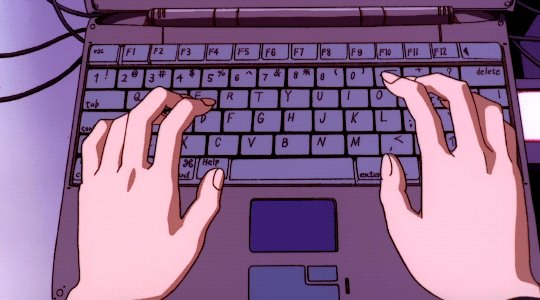
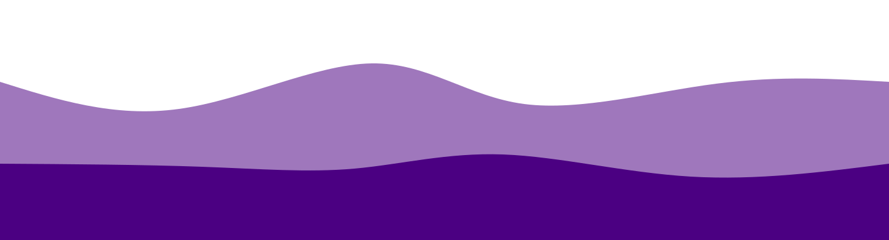

  
   
  

 

  

 

 
  Meu nome é Lucas e sou estudante de Ciências da Computação na Estácio de Sá. Tenho uma paixão pela tecnologia e programação desde cedo. Tenho focado no desenvolvimento web, tanto no Frontend, mas também no Backend. 
  Estou comprometido em me tornar um desenvolvedor qualificado e contribuir com as minhas habilidades.

    💌 Contate-me por meio dessas redes: ⤵️

  

  

    

<h1 align="center">  MINHA STACK </h1>

<table align="right" height="255px">
  <tr>
    <td align="center">
      <a href="https://developer.mozilla.org/en-US/docs/Web/HTML/">
         
        
          <b>
            <pre>HTML5</pre>
          </b>
        
      </a>
    </td>
    <td align="center">
      <a href="https://developer.mozilla.org/en-US/docs/Web/JavaScript/">
         
        
          <b>
            <pre>Javascript</pre>
          </b>
        
      </a>
    </td>
    <td align="center">
      <a href="https://developer.mozilla.org/en-US/docs/Web/CSS/">
         
        
          <b>
            <pre>CSS3</pre>
          </b>
        
      </a>
    </td>
  </tr>
  <tr>
  <tr>
    <td align="center">
      <a href="https://github.com/">
         
        
          <b>
            <pre>Git</pre>
          </b>
        
      </a>
    </td>
     <td align="center">
      <a href="https://github.com/">
         
        
          <b>
            <pre>Github</pre>
          </b>
        
      </a>
    </td>
    <td align="center">
      <a href="https://getbootstrap.com/">
       
      
        <b>
          <pre>Bootstrap</pre>
        </b>
      
      </a>
    </td>
  </tr>
  <tr>
  </tr>
    <td align="center">
      <a href="#">
         
        
          <b>
            <pre>Linux</pre>
          </b>
        
      </a>
    </td>
  </tr>
</table>
           

